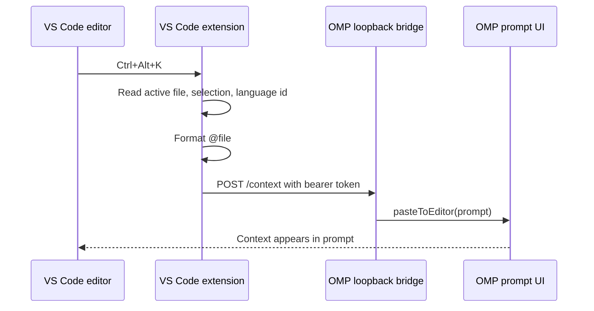

# Concepts

## Intent

**WHY this document exists:** The bridge spans two plugin systems. Future changes need to preserve which side owns editor state, prompt state, and transport security.

**WHAT this document produces:** A compact map of the concepts, request flow, data contract, and known limits.

**Decision Rules:**
- **Editor facts come from VS Code:** Current file, cursor, selection, selected text, and language id are captured by the VS Code extension only.
- **Prompt mutation happens in OMP:** OMP owns the live prompt editor, so prompt insertion uses an OMP runtime extension.
- **Local bridge, not public API:** The HTTP server binds to `127.0.0.1` and requires the token written by the running OMP extension.
- **Reference first:** Default to character-precise `@file#LxCy-LxCy` references for saved workspace files. OMP can read the current file directly, and the prompt avoids duplicating large selections.

## Problem shape

Claude Code and OpenCode feel integrated because the IDE extension knows the editor selection and the agent UI knows how to append to its prompt. OMP has the agent-side extension API, but VS Code still needs a separate extension to read selected text.

This repo is therefore two integrations in one package:

1. VS Code extension: registers `OMP Context: Insert Editor Context` and binds it to `Ctrl+Alt+K` / `Cmd+Alt+K`.
2. OMP extension: starts a loopback bridge and inserts received context into the OMP prompt.

## Runtime flow



## Data contract

The VS Code extension posts JSON to `/context`:

```json
{
  "delivery": "paste",
  "prompt": "In @src/example.ts#L7C17-L9C20 ",
  "reference": "@src/example.ts#L7C17-L9C20",
  "relativePath": "src/example.ts",
  "workspaceFolder": "/workspace/project",
  "filePath": "/workspace/project/src/example.ts",
  "languageId": "typescript",
  "selection": {
    "startLine": 7,
    "endLine": 9,
    "startCharacter": 17,
    "endCharacter": 20,
    "isEmpty": false
  },
  "selectedText": "const value = 1"
}
```

Only `prompt` is required by the current OMP bridge. The extra fields are intentionally included for future behavior: custom renderers, session metadata, or alternate delivery modes.

## Content modes

- `reference`: default. Sends only `In @file#LxCy-LxCy `. Best for saved workspace files because OMP can inspect the file and the prompt stays small.
- `inline`: sends `In @file#LxCy-LxCy ` plus a fenced copy of the selected text. Useful for unsaved buffers, generated output, or when the exact selected bytes matter more than file freshness.

Avoid using inline mode as the default for large selections: OMP will ask whether to attach a wrapped block, save a local attachment file, or paste inline.

## Delivery modes

- `paste`: insert into the live OMP prompt editor. Default. User still decides what to ask.
- `send`: submit the context as a user message immediately.
- `nextTurn`: queue the context for the next OMP turn.

## State file

On session start, the OMP extension writes:

```text
~/.omp/agent/editor-context-bridge.json
```

The file contains:

- `endpoint`: loopback URL chosen by OMP.
- `token`: random bearer token required for `/context`.
- `pid`: OMP process id for debugging stale state.
- `instanceId`: random id for the running OMP terminal bridge.
- `version`: installed plugin package version.
- `updatedAt`: timestamp for diagnosing stale state.

The VS Code setting `ompContext.endpoint` overrides discovery when needed.

## Multiple terminals

Multiple OMP terminals can run the plugin at the same time. Each terminal listens on a different loopback port. The active terminal is whichever bridge last wrote `editor-context-bridge.json`.

Session start and session switch claim the active bridge automatically. Use `/vscode-context-here` to explicitly route VS Code context to the current OMP terminal. Use `/vscode-context-status` to show the endpoint and installed plugin version.

## Shortcut semantics

OpenCode documents `Ctrl+Alt+K` / `Cmd+Alt+K` as a file-reference insertion shortcut. Claude Code documents `Alt+K` / `Option+K` as **Insert @-Mention Reference** and also exposes selected text automatically.

This extension chooses OpenCode's chord because the request named `Ctrl+Alt+K`, and it preserves Claude/OpenCode's safer behavior: insert a reference into the prompt, do not auto-submit by default.

## Limits

- This is not full automatic IDE context awareness. It sends context when the shortcut is pressed.
- Diagnostics, open tabs, terminal output, and live LSP state are not sent.
- The VS Code command requires editor focus because VS Code keybindings with `editorTextFocus` should not steal `Ctrl+Alt+K` from OMP or terminals.
- Multiple running OMP sessions share one active state file. Use `/vscode-context-here` when you need to target a specific terminal explicitly.
